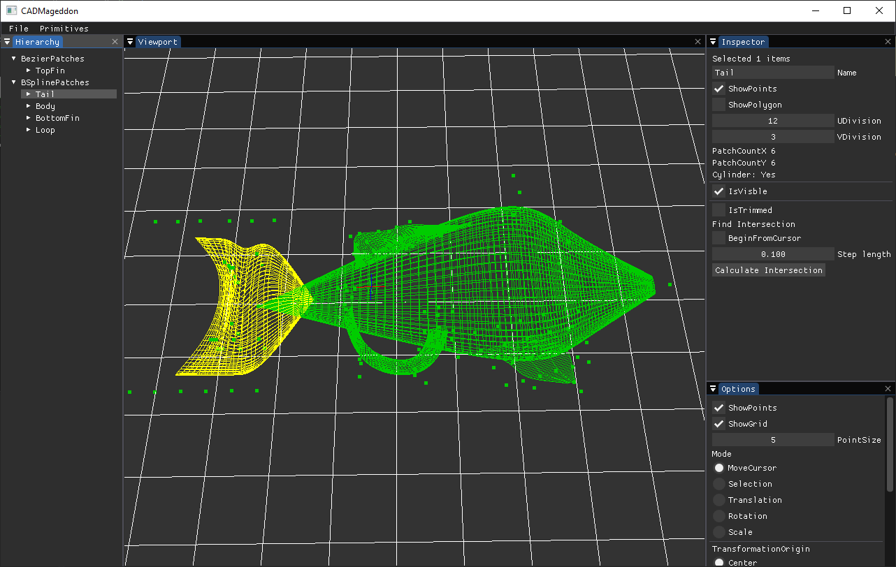

# CADMageddon
Simple CAD editor for creating models using bezier and bspline patches

# Features
- Create and edit bezier Curves
- Create and edit B-spline Curves
- Create and edit Interpolated Curves
- Create and edit Bezier Patches
- Create and edit B-Spline Patches
- Serializition and deserialization of scene
- Stereoscopic view of scene

# Application

# Generate project
Run GenerateProjects.bat to create Visual Studio 2019 solution